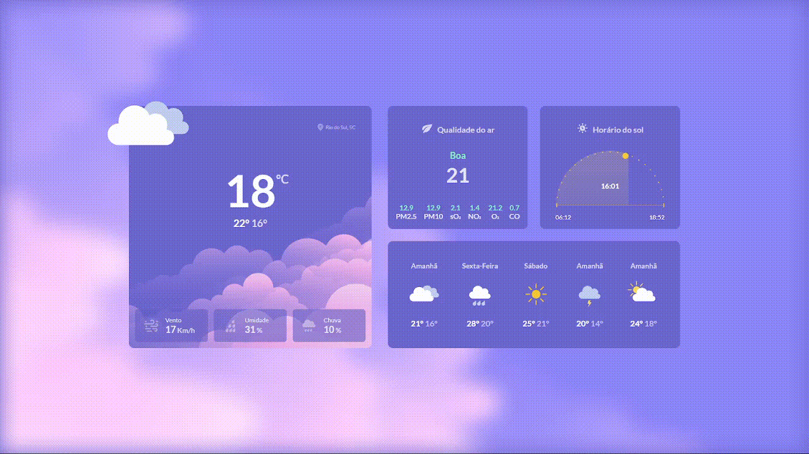
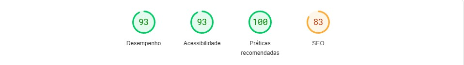

<h1 align="center">Bora Code 10</h1>

  
  
  

## Documentação
  - <a href="#projeto">Projeto</a>
  - <a href="#diario"> Diário de bordo </a>
  - <a href="#estrutura"> Estrutura do Projeto</a>
    - <a href="#stacks"> Stacks</a>
    - <a href="#stacks"> Cores</a>
    - <a href="#wakatime"> Distribuição do Tempo</a>
    - <a href="#page"> PageSpeed Insights</a>
  - <a href="#melhorias"> Melhorias</a>

<h2 id="projeto"> Projeto </h2>

> descrição <a href="" >Link para o site</a>

<h2 id="diario"> Diário de bordo </h2>
<table>
  <thead>
        <tr>
            <th align="center">
                 
                

                    <small>DATA</small>
                

            </th>
            <th align="center">
                 
                
 
                    <small>
                        TAREFA
                    </small>
                

            </th>
            <th align="left">
                
                
 
                    <small>
                     TEMPO
                    </small>
                

            </th>
            <th align="center">
                
                
 
                    <small>
                      COMMITS
                    </small>
                

            </th>
        </tr>
    </thead>
    <tbody>
        <tr>
            <td>15/03</td>
            <td><a href="#estrutura">Estruturação e desenvolvimento</a></td>
            <td>3h 13m</td>
            <td align="center">
            <a href="#commits">2</a></td>
        </tr>
        <tr>
            <td>16/03</td>
            <td><a href="#estrutura">Finalização e deploy</a></td>
            <td>1h 38m</td>
            <td align="center">
            <a href="#commits">1</a></td>
        </tr>
    </tbody>
</table>

<h2 id="estrutura"> Estrutura do Projeto </h2>

<h3 id="stacks"> Stacks utilizadas </h3>
  <strong>Gsap,  <strong>
  <strong>Google Fonts,<strong>
  <strong>Figma,<strong>
  <strong>Wakatime<strong>
  
<h3 id="cores">Cores do Projeto</h3>

| Cor               | Hexadecimal                                                |
| ----------------- | ---------------------------------------------------------------- |
| Font Primary Color      |  #fff |
| Font Secondary Color      |  #DAD8F7 |
| Font Tertiary Color      |  #E7E6FB |
| Font Quarternary Color      |  #C2BFF |
| Background Color      |  #6D67D0 |

<h3 id="wakatime">Tempo distribuido em linguagens </h3>

| # | Tempo         | linguagem                                      |
|--| ----------------- | ---------------------------------------------------------------- |
| # |  3h 42 m | JavasScript (react) |
| # | 59m | css (index.css)|

<h3 id="page">PageSpeed Insights</h3>
Dados do computador 
 
Avalização para dispositivos movéis 

<h2 id="melhorias"> Melhorias ao Projeto</h2>

- Requisições de uma api
- Localização 
- Notificações push

## Licença

[MIT](./LICENSE)

  